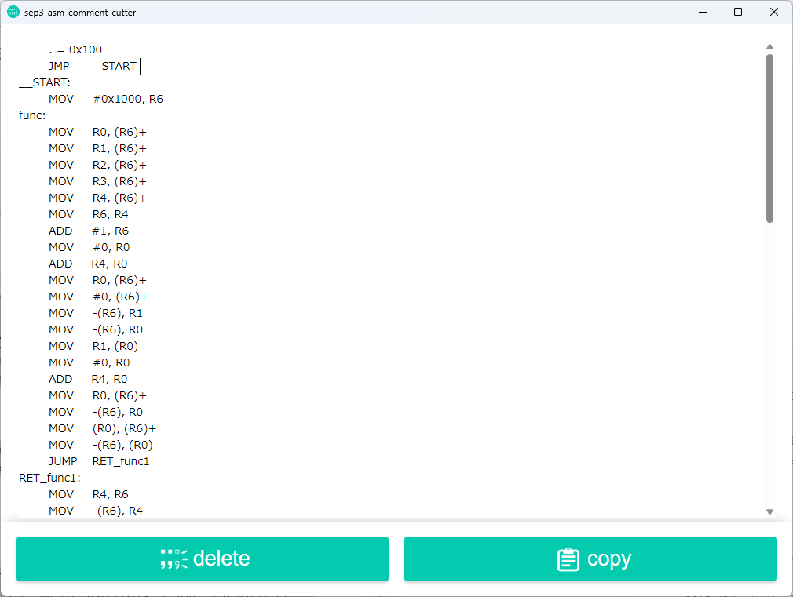

# sep3-asm-comment-cutter-wails

## About
某実験のテストケース生成を楽にするためのソフト．;から始まるコメントを削除してくれる（悪用禁止）．

## Usage
1. 画面にアセンブリをコピー＆ペースト
1. deleteボタンをクリック
1. 必要に応じてcopyボタンをクリック（表示内容が自動的にクリップボードに保存される）

## Execution Environment
以下でビルド可能（[こちら](https://wails.io/ja/docs/gettingstarted/building)を参照）
- Windows
- Mac
- Linux

## Framework, Language
- Wails v2.7.1
- Go v1.21.5
- React.js v18.2.0
- TypeScript v4.6.4
- Node.js v20.10.0